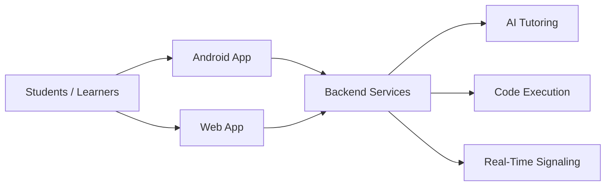

<h1 align="center">Vastavik Coding Stuff</h1>

  <em>Building practical learning platforms, developer tools, and AI-enabled educational experiences.</em>

  
  
  

  
  
  
  

  
  
  
  

---

Vastavik Coding Stuff is a GitHub organization dedicated to building **educational technology** for students and learners. Our core product is the **Vastavik Learning** ecosystem — a cross-platform suite of applications that provides interactive courses, live classrooms, AI-powered tutoring, hands-on code practice, and real-time collaboration tools.

We build for **India-first learners** — accessible, affordable, and practical. Every project in this organization is designed to help students learn by doing, not just watching.

---

## What We Build

- **Educational platforms** — Structured learning paths with courses, lessons, quizzes, and progress tracking
- **Android & mobile applications** — Native Kotlin apps with Jetpack Compose and Material 3
- **Modern web experiences** — SEO-optimized, performant Next.js applications
- **Backend APIs & services** — FastAPI-powered REST, WebSocket, and SSE backends
- **AI-powered tutoring** — Integration with Mistral AI and Google Gemini for contextual learning assistance
- **Real-time collaboration** — Live classrooms, WebRTC signaling, peer chat, and interactive whiteboards
- **Programming tools** — In-browser code execution, OCR exercise scanning, and practice environments

---

## Ecosystem Architecture

The Vastavik Learning ecosystem consists of three primary applications that share a common backend. Students interact through either the Android app or the web app, while the backend services handle authentication, course management, AI tutoring, code execution, payments, and real-time communication.

---

## Featured Projects

### Vastavik Learning — Backend

  

| | |
|---|---|
| **Repository** | [vastavikLearning-backend-app](https://github.com/vastavikCodingStuff/vastavikLearning-backend-app) |
| **Language** | Python 3.11+ |
| **Framework** | FastAPI (async) |
| **Database** | Google Firebase Firestore + in-memory fallback |
| **License** | Apache License 2.0 |

The backend service layer powering the entire Vastavik Learning platform. Built with FastAPI and Uvicorn, it provides REST APIs, WebSocket real-time channels, and Server-Sent Events for AI streaming.

**Key capabilities:**
- **Authentication** — SHA-256 + salt password hashing, JWT (HS256) access/refresh tokens, HMAC-SHA256 request signing, Google OAuth, GitHub OAuth
- **Real-time** — Socket.IO bidirectional events, native WebSockets for peer chat, WebRTC SDP/ICE signaling relay
- **AI Tutoring** — Mistral AI (primary) with Google Gemini fallback chain, local pedagogical fallback for offline scenarios
- **Code Execution** — Judge0 self-hosted sandbox supporting Python, JavaScript, Java, C++, C, and SQL
- **Payments** — PhonePe, Razorpay, Cashfree webhook integration
- **Security** — Dynamic route circuit breaker, in-memory token bucket rate limiter, NGINX reverse proxy with HTTP/2 and SSL
- **Deployment** — Self-hosted Ubuntu VPS with systemd + NGINX + UFW + Fail2ban, Docker Compose, Railway, Render

---

### Vastavik Learning — Android App

  

| | |
|---|---|
| **Repository** | [vastavikLearning-app](https://github.com/vastavikCodingStuff/vastavikLearning-app) |
| **Language** | Kotlin 2.0.20 |
| **UI** | Jetpack Compose (100%) + Material 3 |
| **Architecture** | MVVM + Clean Architecture |
| **License** | Apache License 2.0 |

Native Android client for student-focused learning experiences. Built entirely with Jetpack Compose — zero XML layouts — featuring a custom Neo-Brutalist design system with bold outlines, hard drop shadows, and high-contrast palettes.

**Key capabilities:**
- **11 ViewModels** — Auth, Home, Learning, Chat, Meeting, Practice, Quiz, VideoLesson, Onboarding, Settings, Profile
- **30+ Navigation Routes** — Full app navigation with deep linking via Firebase Dynamic Links
- **Firebase Suite** — Auth, Firestore, Storage, Cloud Messaging, Analytics (BOM 33.7.0)
- **AI Integration** — Mistral AI (3 models), Google Gemini (2 models), Google Generative AI SDK, MLKit Text Recognition for OCR exercise scanning
- **Media** — YouTube Player (embedded playback), Coil (image loading), Lottie (animations), CameraX (OCR capture)
- **Real-time** — OkHttp WebSockets for peer chat, WebRTC signaling, SSE streaming for AI responses
- **Security** — HMAC-SHA256 request signing, JWT auto-refresh via OkHttp Authenticator, device root detection, FLAG_SECURE
- **Background** — WorkManager periodic engagement notifications, Foreground Service for live meetings, in-app OTA updates via GitHub Releases
- **Testing** — JUnit 4, Espresso, Compose UI Test

---

### Vastavik Learning — Web

  

| | |
|---|---|
| **Repository** | [vastavikLearning-web](https://github.com/vastavikCodingStuff/vastavikLearning-web) |
| **Language** | TypeScript 5.6.3 (strict) |
| **Framework** | Next.js 14.2.35 (App Router) |
| **CSS** | Tailwind CSS 3.4.13 + custom Neo-Brutalist design system |
| **Live Site** | [vastaviklearning.online](https://vastaviklearning.online) |
| **License** | Apache License 2.0 |

Web experience for the Vastavik Learning platform. A deliberately minimal, zero-dependency Next.js application with only 3 runtime dependencies (next, react, react-dom). Every UI component, the auth system, and the entire design system are hand-built from scratch.

**Key capabilities:**
- **27 Routes** — Complete web application covering courses, lessons, practice, quiz, live classrooms, AI chat, whiteboard, leaderboard, PYQ archive, and pricing
- **SEO** — Dynamic sitemap, robots.txt, Schema.org JSON-LD structured data (Organization, Course, FAQPage, Product), Open Graph, Twitter Cards, canonical URLs, PWA manifest
- **Security** — 12+ HTTP security headers (HSTS, CSP, X-Frame-Options, COOP/COEP/CORP), documented threat model and security policy
- **Payments** — Razorpay UPI Autopay integration with cards, netbanking, and wallet support
- **Fonts** — Space Grotesk (display), Inter (body), JetBrains Mono (code) via Google Fonts
- **Custom Design System** — 580-line CSS with 6-color accent palette (Yellow, Pink, Blue, Lime, Orange, Purple), hard offset shadows, thick borders, bold typography
- **Deployment** — Vercel with SSG (Static Site Generation) via `generateStaticParams()`

---

## Technology Landscape

  

  

  

### By Category

| Category | Technologies |
|---|---|
| **Languages** | Python, Kotlin, TypeScript |
| **Mobile** | Android (Kotlin), Jetpack Compose, Material 3 |
| **Web** | Next.js 14, React 18, TypeScript, Tailwind CSS |
| **Backend** | FastAPI, Uvicorn, Pydantic v2 |
| **Database** | Google Firebase Firestore |
| **Real-time** | Socket.IO, WebSockets, WebRTC, Server-Sent Events |
| **AI/ML** | Mistral AI, Google Gemini, Google Generative AI SDK, MLKit |
| **Authentication** | JWT (HS256), HMAC-SHA256, Google OAuth, GitHub OAuth |
| **Payments** | Razorpay (UPI Autopay), PhonePe, Cashfree |
| **Code Execution** | Judge0 (self-hosted) |
| **Containerization** | Docker, Docker Compose |
| **Reverse Proxy** | NGINX (HTTP/2, SSL, rate limiting) |
| **Deployment** | Vercel, Railway, Render, Self-hosted Ubuntu VPS |
| **Tooling** | Git, GitHub, Gradle, PostCSS |

---

## Repository Directory

| Repository | Description | Primary Language | Link |
|---|---|---|---|
| **vastavikLearning-backend-app** | Backend services and API layer for the Vastavik Learning platform | Python | [View →](https://github.com/vastavikCodingStuff/vastavikLearning-backend-app) |
| **vastavikLearning-app** | Native Android client for student learning experiences | Kotlin | [View →](https://github.com/vastavikCodingStuff/vastavikLearning-app) |
| **vastavikLearning-web** | Web experience for the Vastavik Learning platform | TypeScript | [View →](https://github.com/vastavikCodingStuff/vastavikLearning-web) · [Live →](https://vastaviklearning.online) |
| **.github** | Organization profile, README, and shared resources | — | [View →](https://github.com/vastavikCodingStuff/.github) |

---

## Workflow and Values

- **Learner-first design** — Every feature starts with the question: "Does this help a student learn better?"
- **Maintainable code** — Clean architecture, consistent patterns, and thorough documentation across all repositories
- **Iterative development** — Ship early, gather feedback, improve continuously. Every project is actively evolving
- **Open collaboration** — We welcome issues, feature requests, and pull requests from the community
- **Responsible AI** — AI features are designed as learning assistants, not replacements for understanding. Human judgment remains central

---

## Open Source and Contribution

All three application repositories ([backend](https://github.com/vastavikCodingStuff/vastavikLearning-backend-app), [Android app](https://github.com/vastavikCodingStuff/vastavikLearning-app), [web app](https://github.com/vastavikCodingStuff/vastavikLearning-web)) are released under the **Apache License 2.0**.

To contribute:

1. **Explore** the repositories and find something you'd like to improve
2. **Open an issue** in the relevant repository to discuss your proposal
3. **Fork and branch** — create a feature branch from `main`
4. **Submit a pull request** — describe your changes clearly and link any related issues

Check each repository's `LICENSE` file for the authoritative license terms.

---

  <strong>Learning through building. Building for learners.</strong>

  
  

